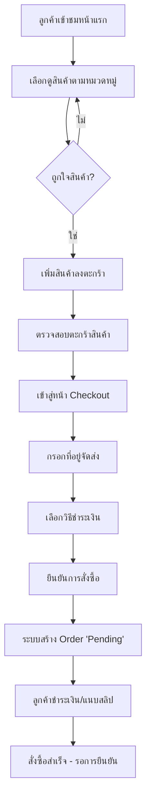
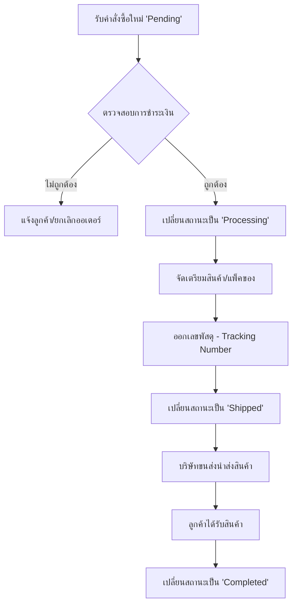
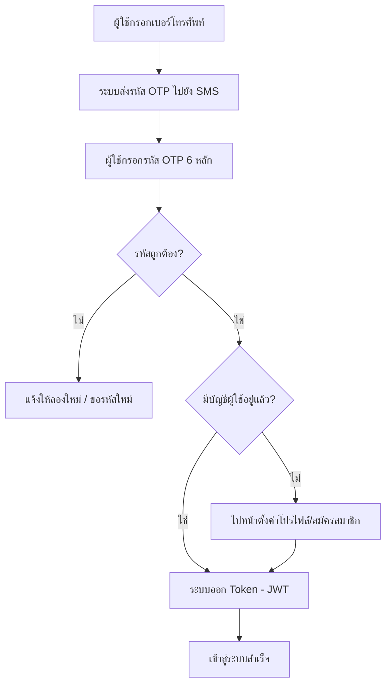
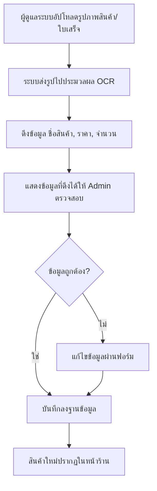
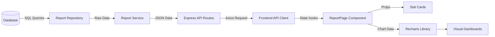
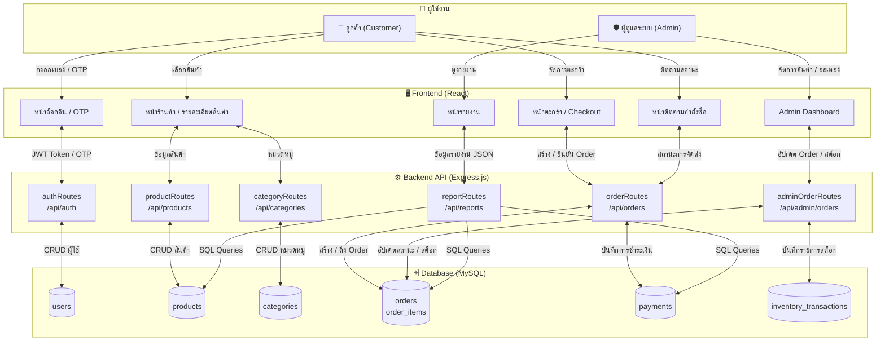
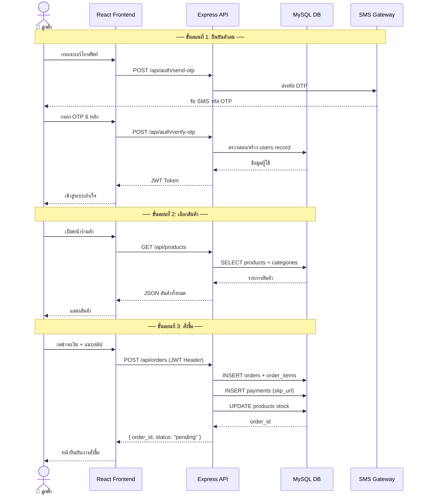
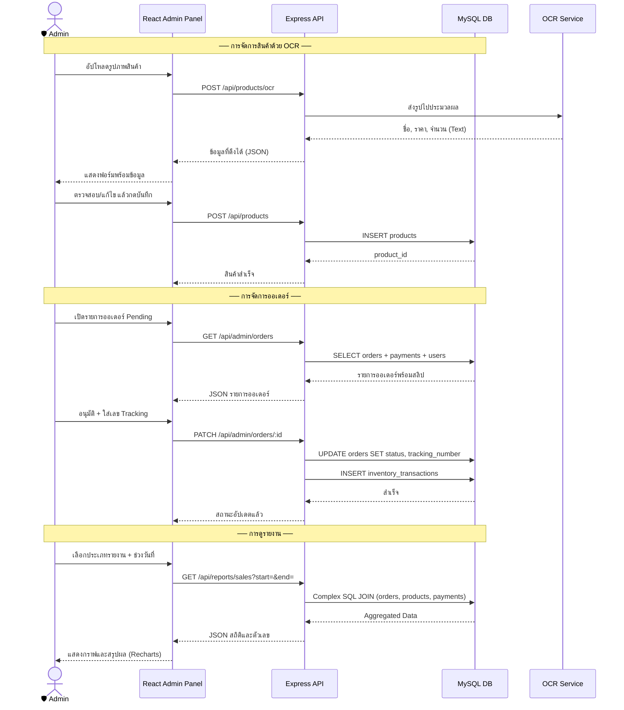
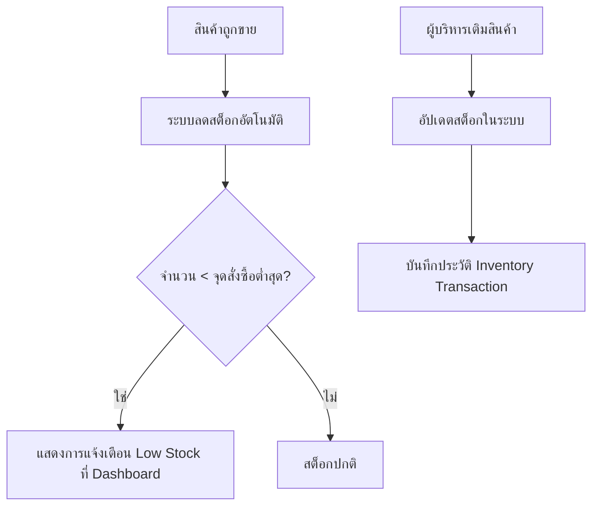

# ระบบงาน Chambot (System Flowcharts)

เอกสารนี้แสดงแผนผังการทำงาน (Flowcharts) ของระบบหลักในโครงการ Chambot เพื่อให้เข้าใจกระบวนการทำงานของแต่ละส่วนได้ง่ายขึ้น

---

## 0. Context Diagram — ภาพรวมระบบ (Level 0 DFD)
แสดงระบบ Chambot ในฐานะกระบวนการเดียว พร้อม External Entities ทั้งหมดที่โต้ตอบกับระบบ

```mermaid
flowchart LR
    %% ── External Entities ──
    CUST[\"👤 ลูกค้า\\n(Customer)\"]
    ADMIN[\"🛡️ ผู้ดูแลระบบ\\n(Admin)\"]
    SMS[\"📱 SMS Gateway\\n(OTP Provider)\"]
    OCR[\"🔍 OCR Service\\n(Image Processing)\"]
    SHIP[\"🚚 บริษัทขนส่ง\\n(Shipping)\"]

    %% ── System ──
    SYS[\"⚙️ ระบบ CHAMBOT\\n━━━━━━━━━━━━━━━━━\\nFrontend · Backend API\\nMySQL Database\"]

    %% ── Customer ↔ System ──
    CUST -- \"เบอร์โทร / OTP\" --> SYS
    CUST -- \"เลือกสินค้า / สั่งซื้อ\" --> SYS
    CUST -- \"แนบสลิปชำระเงิน\" --> SYS
    SYS -- \"JWT Token / สถานะออเดอร์\" --> CUST
    SYS -- \"รายการสินค้า / ยืนยันคำสั่งซื้อ\" --> CUST

    %% ── Admin ↔ System ──
    ADMIN -- \"จัดการสินค้า / อนุมัติออเดอร์\" --> SYS
    ADMIN -- \"อัปโหลดรูปสินค้า (OCR)\" --> SYS
    ADMIN -- \"เลือกดูรายงาน\" --> SYS
    SYS -- \"ข้อมูลรายงาน / สถิติ\" --> ADMIN
    SYS -- \"รายการออเดอร์ Pending\" --> ADMIN

    %% ── External Services ──
    SYS -- \"ส่งคำขอ OTP\" --> SMS
    SMS -- \"รหัส OTP\" --> CUST

    SYS -- \"ส่งรูปภาพ\" --> OCR
    OCR -- \"ข้อมูลข้อความ (ชื่อ, ราคา, จำนวน)\" --> SYS

    SYS -- \"เลขพัสดุ / ข้อมูลจัดส่ง\" --> SHIP
    SHIP -- \"สถานะการจัดส่ง\" --> SYS

    %% ── Styles ──
    style SYS fill:#1e3a5f,stroke:#4a90d9,color:#ffffff,font-size:14px
    style CUST fill:#2d6a4f,stroke:#74c69d,color:#ffffff
    style ADMIN fill:#6b2737,stroke:#e07b8a,color:#ffffff
    style SMS  fill:#5a3e8a,stroke:#a78bfa,color:#ffffff
    style OCR  fill:#7a4a1e,stroke:#f4a35a,color:#ffffff
    style SHIP fill:#1a5276,stroke:#5dade2,color:#ffffff
```

---

## 1. กระบวนการซื้อสินค้า (Shopping Flow)
แสดงขั้นตอนตั้งแต่ลูกค้าเข้าชมร้านค้าจนถึงสั่งซื้อสำเร็จ



---

## 2. กระบวนการจัดการคำสั่งซื้อ (Admin Order Flow)
แสดงขั้นตอนการทำงานของฝั่งผู้ดูแลระบบเมื่อได้รับคำสั่งซื้อ



---

## 3. ระบบยืนยันตัวตน (Authentication Flow)
แสดงขั้นตอนการเข้าสู่ระบบด้วยหมายเลขโทรศัพท์และ OTP



---

## 4. ระบบนำเข้าข้อมูลด้วยรูปภาพ (OCR Import Flow)
แสดงขั้นตอนการเพิ่มสินค้าใหม่ผ่านการสแกนรูปภาพ



---

## 6. ระบบรายงานและวิเคราะห์ผล (Reporting Flow)
แสดงขั้นตอนการดึงข้อมูลจาก Database มาแสดงเป็นแผนภูมิต่างๆ



---

## 7. Data Flow Diagram — ภาพรวมระบบ (System-Level DFD)
แสดงการไหลของข้อมูลระหว่าง ลูกค้า, ผู้ดูแลระบบ, Backend API, และ Database



---

## 8. Data Flow — ฝั่งลูกค้า (Customer Data Flow)
แสดงการไหลของข้อมูลตั้งแต่การยืนยันตัวตนจนถึงการสั่งซื้อสำเร็จ



---

## 9. Data Flow — ฝั่งผู้ดูแลระบบ (Admin Data Flow)
แสดงการไหลของข้อมูลสำหรับการจัดการสินค้า, ออเดอร์, และดูรายงาน



---

## 5. ระบบจัดการสต็อก (Inventory Flow)
แสดงขั้นตอนการปรับปรุงจำนวนสินค้าและระบบแจ้งเตือน


