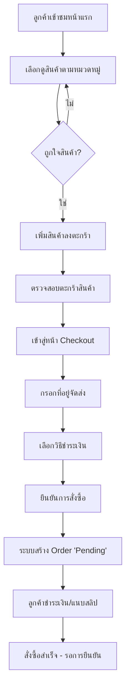
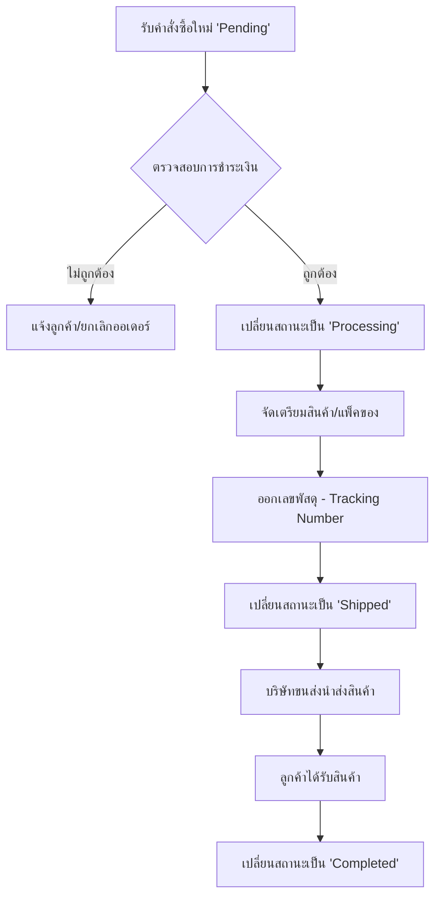
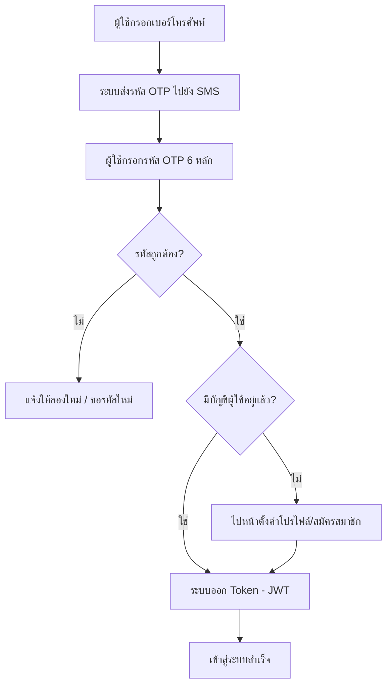
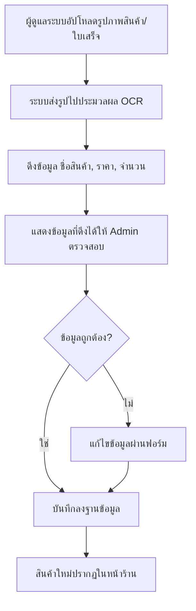
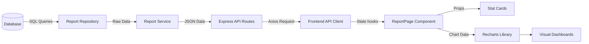
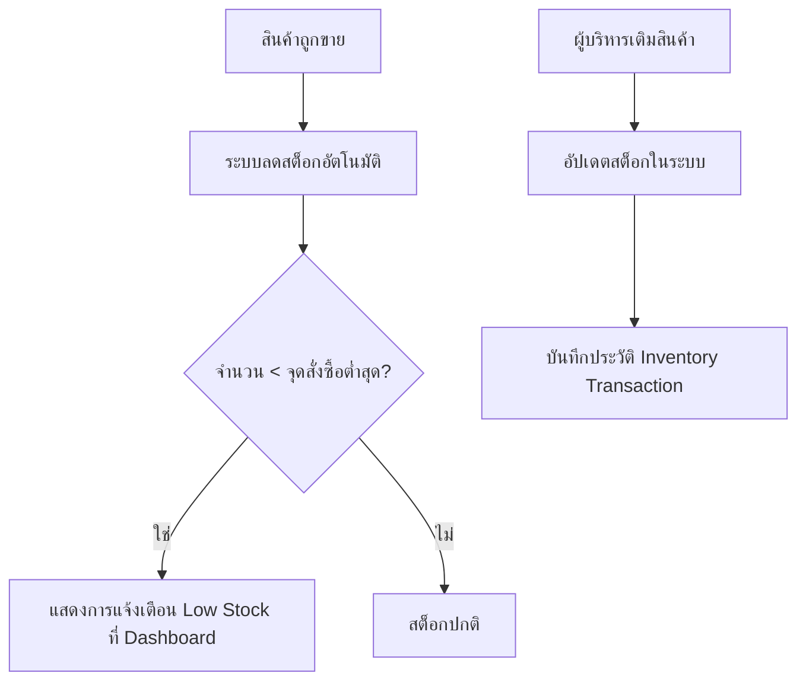

# ระบบงาน Chambot (System Flowcharts)

เอกสารนี้แสดงแผนผังการทำงาน (Flowcharts) ของระบบหลักในโครงการ Chambot เพื่อให้เข้าใจกระบวนการทำงานของแต่ละส่วนได้ง่ายขึ้น

---

## 1. กระบวนการซื้อสินค้า (Shopping Flow)
แสดงขั้นตอนตั้งแต่ลูกค้าเข้าชมร้านค้าจนถึงสั่งซื้อสำเร็จ

---

## 2. กระบวนการจัดการคำสั่งซื้อ (Admin Order Flow)
แสดงขั้นตอนการทำงานของฝั่งผู้ดูแลระบบเมื่อได้รับคำสั่งซื้อ

---

## 3. ระบบยืนยันตัวตน (Authentication Flow)
แสดงขั้นตอนการเข้าสู่ระบบด้วยหมายเลขโทรศัพท์และ OTP

---

## 4. ระบบนำเข้าข้อมูลด้วยรูปภาพ (OCR Import Flow)
แสดงขั้นตอนการเพิ่มสินค้าใหม่ผ่านการสแกนรูปภาพ

---

## 6. ระบบรายงานและวิเคราะห์ผล (Reporting Flow)
แสดงขั้นตอนการดึงข้อมูลจาก Database มาแสดงเป็นแผนภูมิต่างๆ

---

## 5. ระบบจัดการสต็อก (Inventory Flow)
แสดงขั้นตอนการปรับปรุงจำนวนสินค้าและระบบแจ้งเตือน

