# Chambot — System Flowcharts (ฉบับสมบูรณ์)

ระบบ **Chambot** เป็น E-Commerce สำหรับสินค้าเกษตรและกาแฟ  
Stack: **React** (Frontend) · **Express.js** (Backend) · **PostgreSQL/Supabase** (Database)

---

## 1. ภาพรวมระบบทั้งหมด (System Architecture Overview)

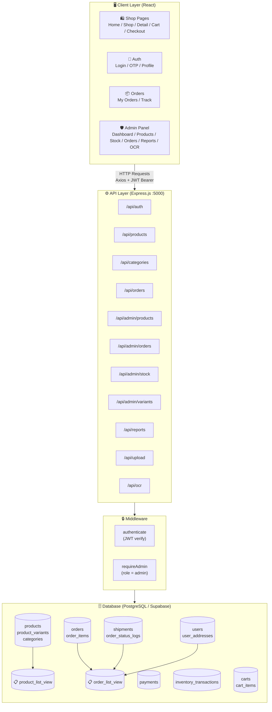
```mermaid
flowchart TB
    subgraph CLIENT["🖥️ Client Layer (React)"]
        direction LR
        UI_SHOP["🛍️ Shop Pages\nHome / Shop / Detail / Cart / Checkout"]
        UI_AUTH["🔐 Auth\nLogin / OTP / Profile"]
        UI_ORDER["📦 Orders\nMy Orders / Track"]
        UI_ADMIN["🛡️ Admin Panel\nDashboard / Products / Stock / Orders / Reports / OCR"]
    end

    subgraph API["⚙️ API Layer (Express.js :5000)"]
        direction LR
        R_AUTH["/api/auth"]
        R_PROD["/api/products"]
        R_CAT["/api/categories"]
        R_ORDER["/api/orders"]
        R_ADMIN_PROD["/api/admin/products"]
        R_ADMIN_ORD["/api/admin/orders"]
        R_ADMIN_STOCK["/api/admin/stock"]
        R_ADMIN_VARIANT["/api/admin/variants"]
        R_REPORT["/api/reports"]
        R_UPLOAD["/api/upload"]
        R_OCR["/api/ocr"]
    end

    subgraph MIDDLEWARE["🔒 Middleware"]
        MW_AUTH["authenticate\n(JWT verify)"]
        MW_ADMIN["requireAdmin\n(role = admin)"]
    end

    subgraph DB["🗄️ Database (PostgreSQL / Supabase)"]
        direction TB
        T_USERS[("users\nuser_addresses")]
        T_PROD[("products\nproduct_variants\ncategories")]
        T_ORDERS[("orders\norder_items")]
        T_PAY[("payments")]
        T_SHIP[("shipments\norder_status_logs")]
        T_INV[("inventory_transactions")]
        T_CART[("carts\ncart_items")]
        V_PROD[("📋 product_list_view")]
        V_ORDER[("📋 order_list_view")]
    end

    CLIENT -->|"HTTP Requests\nAxios + JWT Bearer"| API
    API --> MIDDLEWARE
    MIDDLEWARE --> DB
    T_PROD --> V_PROD
    T_ORDERS --> V_ORDER
    T_SHIP --> V_ORDER
    T_USERS --> V_ORDER
```

---

## 2. ระบบยืนยันตัวตน (Authentication Flow)

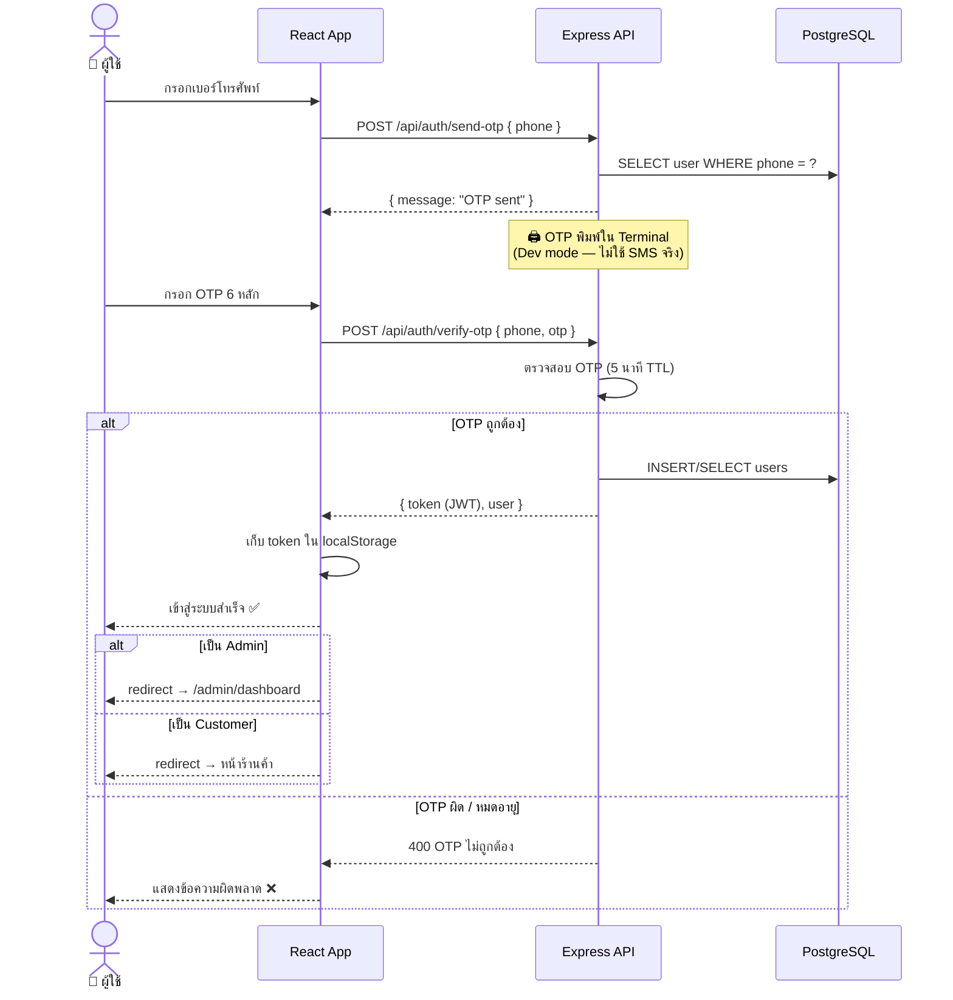
```mermaid
sequenceDiagram
    actor U as 👤 ผู้ใช้
    participant FE as React App
    participant API as Express API
    participant DB as PostgreSQL

    U->>FE: กรอกเบอร์โทรศัพท์
    FE->>API: POST /api/auth/send-otp { phone }
    API->>DB: SELECT user WHERE phone = ?
    API-->>FE: { message: "OTP sent" }
    Note over API: 🖨️ OTP พิมพ์ใน Terminal<br>(Dev mode — ไม่ใช้ SMS จริง)

    U->>FE: กรอก OTP 6 หลัก
    FE->>API: POST /api/auth/verify-otp { phone, otp }
    API->>API: ตรวจสอบ OTP (5 นาที TTL)

    alt OTP ถูกต้อง
        API->>DB: INSERT/SELECT users
        API-->>FE: { token (JWT), user }
        FE->>FE: เก็บ token ใน localStorage
        FE-->>U: เข้าสู่ระบบสำเร็จ ✅

        alt เป็น Admin
            FE-->>U: redirect → /admin/dashboard
        else เป็น Customer
            FE-->>U: redirect → หน้าร้านค้า
        end
    else OTP ผิด / หมดอายุ
        API-->>FE: 400 OTP ไม่ถูกต้อง
        FE-->>U: แสดงข้อความผิดพลาด ❌
    end
```

---

## 3. กระบวนการซื้อสินค้า (Customer Shopping Flow)

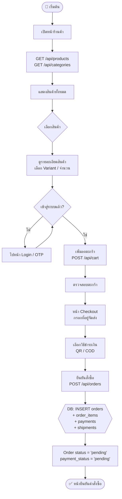
```mermaid
flowchart TD
    A([🚀 เริ่มต้น]) --> B[เปิดหน้าร้านค้า]
    B --> C["GET /api/products\nGET /api/categories"]
    C --> D[แสดงสินค้าทั้งหมด]
    D --> E{เลือกสินค้า}
    E --> F[ดูรายละเอียดสินค้า\nเลือก Variant / จำนวน]
    F --> G{เข้าสู่ระบบแล้ว?}
    G -- ไม่ --> H[ไปหน้า Login / OTP]
    H --> G
    G -- ใช่ --> I["เพิ่มลงตะกร้า\nPOST /api/cart"]
    I --> J[ตรวจสอบตะกร้า]
    J --> K[หน้า Checkout\nกรอกที่อยู่จัดส่ง]
    K --> L[เลือกวิธีชำระเงิน\nQR / COD]
    L --> M["ยืนยันสั่งซื้อ\nPOST /api/orders"]
    M --> N{{"DB: INSERT orders\n+ order_items\n+ payments\n+ shipments"}}
    N --> O[Order status = 'pending'\npayment_status = 'pending']
    O --> P([✅ หน้ายืนยันคำสั่งซื้อ])
```

---

## 4. กระบวนการ Admin จัดการคำสั่งซื้อ (Admin Order Management)

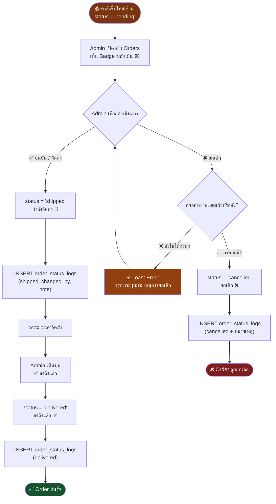
```mermaid
flowchart TD
    START(["📥 คำสั่งซื้อใหม่เข้ามา\nstatus = 'pending'"])
    START --> VIEW["Admin เปิดหน้า Orders\nเห็น Badge รอยืนยัน 🟡"]
    VIEW --> CHOICE{Admin เลือกดำเนินการ}

    %% ── Path A: ยืนยัน ──────────────────────────────
    CHOICE -- "✅ ยืนยัน / จัดส่ง" --> SHIP["status = 'shipped'\nกำลังจัดส่ง 🛵"]
    SHIP --> LOG1["INSERT order_status_logs\n(shipped, changed_by, note)"]
    LOG1 --> WAIT["รอระยะเวลาจัดส่ง"]
    WAIT --> DELIVER_BTN["Admin เห็นปุ่ม\n✅ ส่งถึงแล้ว"]
    DELIVER_BTN --> DELIVERED["status = 'delivered'\nส่งถึงแล้ว ✅"]
    DELIVERED --> LOG2["INSERT order_status_logs\n(delivered)"]
    LOG2 --> DONE(["✅ Order สำเร็จ"])

    %% ── Path B: ยกเลิก ──────────────────────────────
    CHOICE -- "✖ ยกเลิก" --> NOTE_CHECK{"กรอกหมายเหตุแล้วหรือยัง?"}
    NOTE_CHECK -- "❌ ยังไม่ได้กรอก" --> WARN["⚠️ Toast Error:\nกรุณาระบุหมายเหตุการยกเลิก"]
    WARN --> CHOICE
    NOTE_CHECK -- "✅ กรอกแล้ว" --> CANCEL["status = 'cancelled'\nยกเลิก ❌"]
    CANCEL --> LOG3["INSERT order_status_logs\n(cancelled + หมายเหตุ)"]
    LOG3 --> DONE2(["❌ Order ถูกยกเลิก"])

    style START fill:#78350f,color:#fff
    style DONE  fill:#14532d,color:#fff
    style DONE2 fill:#7f1d1d,color:#fff
    style WARN  fill:#92400e,color:#fff
```

### สถานะ Order (ENUM ใน SCHEMA.sql)

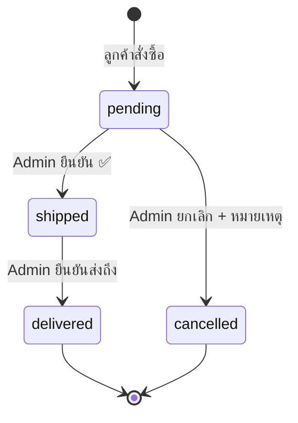
```mermaid
stateDiagram-v2
    [*] --> pending : ลูกค้าสั่งซื้อ
    pending --> shipped   : Admin ยืนยัน ✅
    pending --> cancelled : Admin ยกเลิก + หมายเหตุ
    shipped --> delivered : Admin ยืนยันส่งถึง
    delivered --> [*]
    cancelled --> [*]
```

---

## 5. ระบบจัดการสินค้า (Product Management Flow)

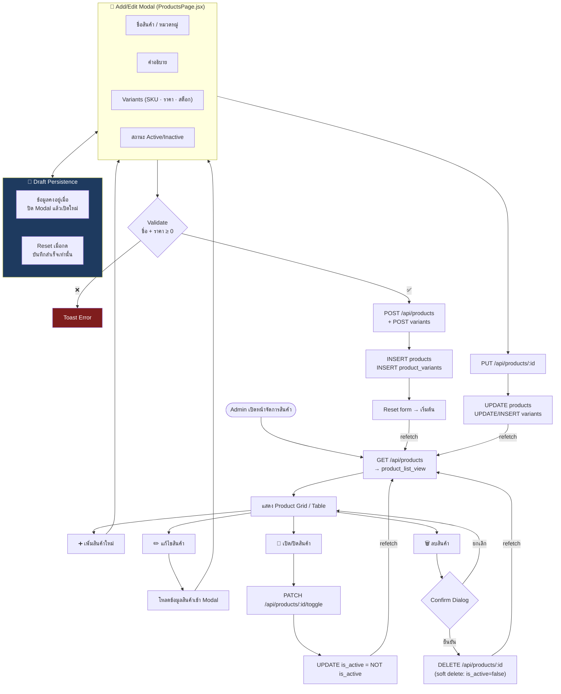
```mermaid
flowchart TD
    subgraph MODAL["📝 Add/Edit Modal (ProductsPage.jsx)"]
        F1["ชื่อสินค้า / หมวดหมู่"]
        F2["คำอธิบาย"]
        F3["Variants (SKU · ราคา · สต็อก)"]
        F4["สถานะ Active/Inactive"]
    end

    subgraph DRAFT["💾 Draft Persistence"]
        D1["ข้อมูลคงอยู่เมื่อ\nปิด Modal แล้วเปิดใหม่"]
        D2["Reset เมื่อกด\nบันทึกสำเร็จเท่านั้น"]
    end

    A(["Admin เปิดหน้าจัดการสินค้า"]) --> B["GET /api/products\n→ product_list_view"]
    B --> C["แสดง Product Grid / Table"]

    C --> ADD["➕ เพิ่มสินค้าใหม่"]
    C --> EDIT["✏️ แก้ไขสินค้า"]
    C --> TOGGLE["🔄 เปิด/ปิดสินค้า"]
    C --> DEL["🗑️ ลบสินค้า"]

    %% Add flow
    ADD --> MODAL
    MODAL <--> DRAFT
    MODAL --> VAL{"Validate\nชื่อ + ราคา ≥ 0"}
    VAL -- ❌ --> ERR["Toast Error"]
    VAL -- ✅ --> POST["POST /api/products\n+ POST variants"]
    POST --> DB1["INSERT products\nINSERT product_variants"]
    DB1 --> RESET["Reset form → เริ่มต้น"]
    RESET --> |"refetch"| B

    %% Edit flow
    EDIT --> MODAL2["โหลดข้อมูลสินค้าเข้า Modal"]
    MODAL2 --> MODAL
    MODAL --> PUT["PUT /api/products/:id"]
    PUT --> DB2["UPDATE products\nUPDATE/INSERT variants"]
    DB2 --> |"refetch"| B

    %% Toggle
    TOGGLE --> PATCH["PATCH /api/products/:id/toggle"]
    PATCH --> DB3["UPDATE is_active = NOT is_active"]
    DB3 --> |"refetch"| B

    %% Delete
    DEL --> CONFIRM{"Confirm Dialog"}
    CONFIRM -- ยกเลิก --> C
    CONFIRM -- ยืนยัน --> DELET["DELETE /api/products/:id\n(soft delete: is_active=false)"]
    DELET --> |"refetch"| B

    style ERR fill:#7f1d1d,color:#fff
    style DRAFT fill:#1e3a5f,color:#fff
```

### Variant Management

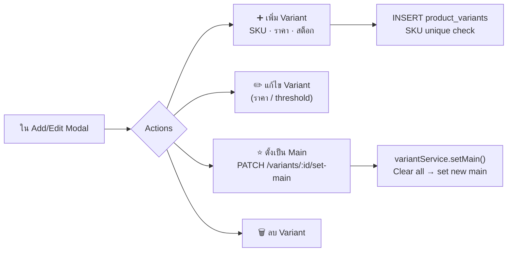
```mermaid
flowchart LR
    A["ใน Add/Edit Modal"] --> B{"Actions"}
    B --> B1["➕ เพิ่ม Variant\nSKU · ราคา · สต็อก"]
    B --> B2["✏️ แก้ไข Variant\n(ราคา / threshold)"]
    B --> B3["⭐ ตั้งเป็น Main\nPATCH /variants/:id/set-main"]
    B --> B4["🗑️ ลบ Variant"]

    B3 --> DB["variantService.setMain()\nClear all → set new main"]
    B1 --> DB2["INSERT product_variants\nSKU unique check"]
```

---

## 6. ระบบจัดการสต็อก (Stock Management Flow)

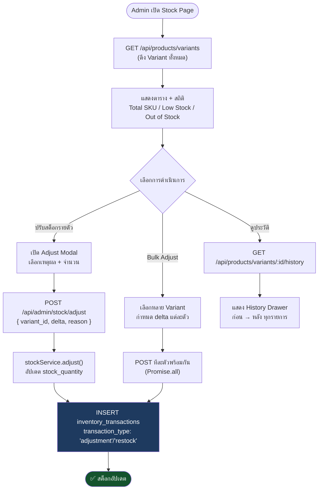
```mermaid
flowchart TD
    A([Admin เปิด Stock Page]) --> B["GET /api/products/variants\n(ดึง Variant ทั้งหมด)"]
    B --> C[แสดงตาราง + สถิติ\nTotal SKU / Low Stock / Out of Stock]

    C --> D{เลือกการดำเนินการ}

    D -- ปรับสต็อกรายตัว --> E[เปิด Adjust Modal\nเลือกเหตุผล + จำนวน]
    E --> F["POST /api/admin/stock/adjust\n{ variant_id, delta, reason }"]
    F --> G["stockService.adjust()\nอัปเดต stock_quantity"]
    G --> H["INSERT inventory_transactions\ntransaction_type: 'adjustment'/'restock'"]

    D -- Bulk Adjust --> I[เลือกหลาย Variant\nกำหนด delta แต่ละตัว]
    I --> J["POST ทีละตัวพร้อมกัน\n(Promise.all)"]
    J --> H

    D -- ดูประวัติ --> K["GET /api/products/variants/:id/history"]
    K --> L[แสดง History Drawer\nก่อน → หลัง ทุกรายการ]

    H --> M([✅ สต็อกอัปเดต])

    style H fill:#1e3a5f,color:#fff
    style M fill:#14532d,color:#fff
```

---

## 7. ระบบรายงาน (Reporting Flow)

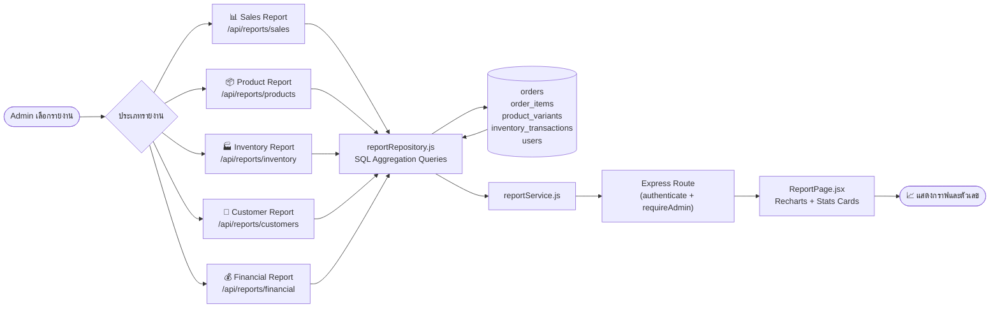
```mermaid
flowchart LR
    A([Admin เลือกรายงาน]) --> B{ประเภทรายงาน}

    B --> C["📊 Sales Report\n/api/reports/sales"]
    B --> D["📦 Product Report\n/api/reports/products"]
    B --> E["🏭 Inventory Report\n/api/reports/inventory"]
    B --> F["👥 Customer Report\n/api/reports/customers"]
    B --> G["💰 Financial Report\n/api/reports/financial"]

    C --> R["reportRepository.js\nSQL Aggregation Queries"]
    D --> R
    E --> R
    F --> R
    G --> R

    R --> DB[("orders\norder_items\nproduct_variants\ninventory_transactions\nusers")]

    DB --> R
    R --> RS["reportService.js"]
    RS --> API["Express Route\n(authenticate + requireAdmin)"]
    API --> FE["ReportPage.jsx\nRecharts + Stats Cards"]
    FE --> A2([📈 แสดงกราฟและตัวเลข])
```

---

## 8. ระบบนำเข้าข้อมูลด้วย OCR (OCR Import Flow)

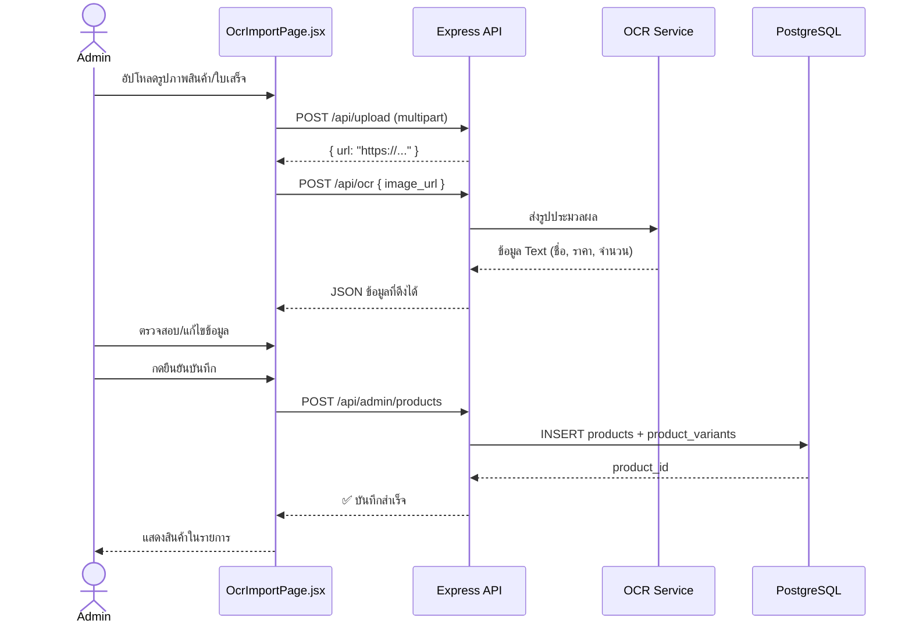
```mermaid
sequenceDiagram
    actor Admin
    participant FE as OcrImportPage.jsx
    participant API as Express API
    participant OCR as OCR Service
    participant DB as PostgreSQL

    Admin->>FE: อัปโหลดรูปภาพสินค้า/ใบเสร็จ
    FE->>API: POST /api/upload (multipart)
    API-->>FE: { url: "https://..." }

    FE->>API: POST /api/ocr { image_url }
    API->>OCR: ส่งรูปประมวลผล
    OCR-->>API: ข้อมูล Text (ชื่อ, ราคา, จำนวน)
    API-->>FE: JSON ข้อมูลที่ดึงได้

    Admin->>FE: ตรวจสอบ/แก้ไขข้อมูล
    Admin->>FE: กดยืนยันบันทึก
    FE->>API: POST /api/admin/products
    API->>DB: INSERT products + product_variants
    DB-->>API: product_id
    API-->>FE: ✅ บันทึกสำเร็จ
    FE-->>Admin: แสดงสินค้าในรายการ
```

---

## 9. ระบบ Inventory / Stock Ledger

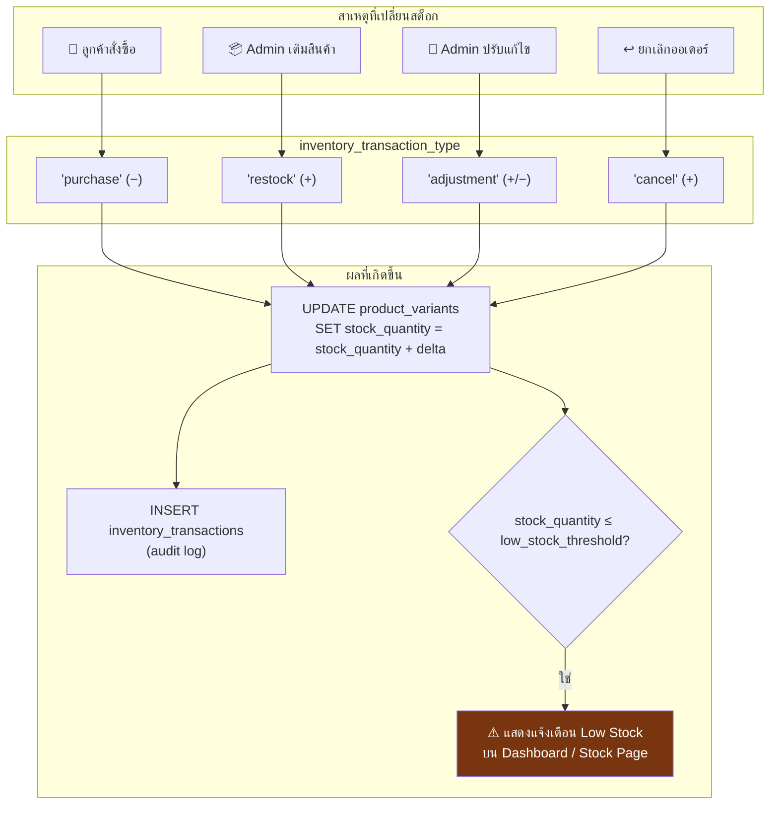
```mermaid
flowchart TD
    subgraph TRIGGERS["สาเหตุที่เปลี่ยนสต็อก"]
        T1["🛒 ลูกค้าสั่งซื้อ"]
        T2["📦 Admin เติมสินค้า"]
        T3["🔧 Admin ปรับแก้ไข"]
        T4["↩️ ยกเลิกออเดอร์"]
    end

    subgraph TYPES["inventory_transaction_type"]
        TY1["'purchase' (−)"]
        TY2["'restock' (+)"]
        TY3["'adjustment' (+/−)"]
        TY4["'cancel' (+)"]
    end

    subgraph EFFECT["ผลที่เกิดขึ้น"]
        E1["UPDATE product_variants\nSET stock_quantity = stock_quantity + delta"]
        E2["INSERT inventory_transactions\n(audit log)"]
        E3{stock_quantity ≤ low_stock_threshold?}
        E4["⚠️ แสดงแจ้งเตือน Low Stock\nบน Dashboard / Stock Page"]
    end

    T1 --> TY1 --> E1
    T2 --> TY2 --> E1
    T3 --> TY3 --> E1
    T4 --> TY4 --> E1
    E1 --> E2
    E1 --> E3
    E3 -- ใช่ --> E4

    style E4 fill:#78350f,color:#fff
```

---

## 10. สรุป API Routes ทั้งหมด (API Map)

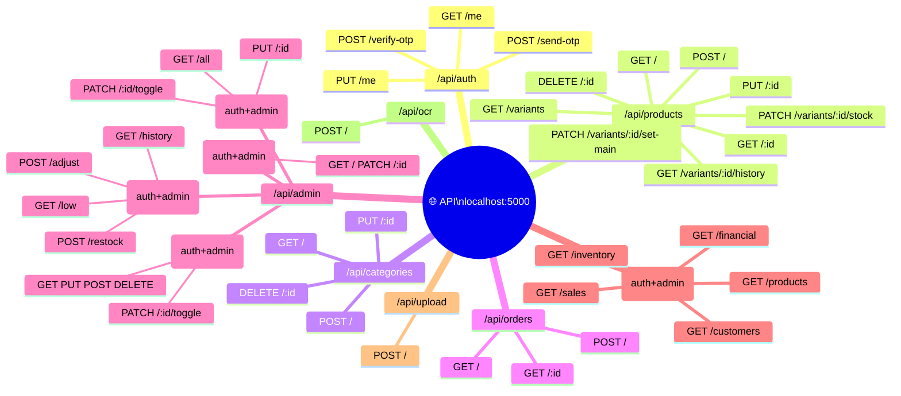
```mermaid
mindmap
  root((🌐 API\nlocalhost:5000))
    /api/auth
      POST /send-otp
      POST /verify-otp
      GET  /me
      PUT  /me
    /api/products
      GET  /
      GET  /:id
      POST /
      PUT  /:id
      DELETE /:id
      GET  /variants
      GET  /variants/:id/history
      PATCH /variants/:id/set-main
      PATCH /variants/:id/stock
    /api/categories
      GET  /
      POST /
      PUT  /:id
      DELETE /:id
    /api/orders
      GET  /
      POST /
      GET  /:id
    /api/admin
      /products (auth+admin)
        GET PUT POST DELETE
        PATCH /:id/toggle
      /orders (auth+admin)
        GET / PATCH /:id
      /stock (auth+admin)
        POST /restock
        POST /adjust
        GET  /low
        GET  /history
      /variants (auth+admin)
        GET  /all
        PUT  /:id
        PATCH /:id/toggle
    /api/reports (auth+admin)
      GET /sales
      GET /products
      GET /inventory
      GET /customers
      GET /financial
    /api/upload
      POST /
    /api/ocr
      POST /
```

---

# 🛡️ Admin System Flowcharts (ระบบฝั่งผู้ดูแล)

---

## A1. ภาพรวม Admin Panel

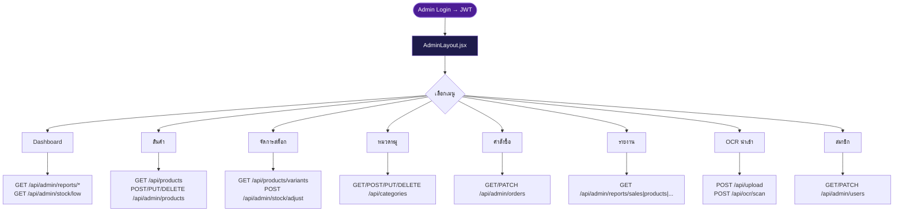
```mermaid
flowchart TD
    LOGIN([Admin Login → JWT]) --> LAYOUT[AdminLayout.jsx]
    LAYOUT --> NAV{เลือกเมนู}

    NAV --> DA[Dashboard]
    NAV --> PR[สินค้า]
    NAV --> ST[จัดการสต็อก]
    NAV --> CA[หมวดหมู่]
    NAV --> OR[คำสั่งซื้อ]
    NAV --> RP[รายงาน]
    NAV --> OC[OCR นำเข้า]
    NAV --> MB[สมาชิก]

    DA --> DA_API["GET /api/admin/reports/*\nGET /api/admin/stock/low"]
    PR --> PR_API["GET /api/products\nPOST/PUT/DELETE /api/admin/products"]
    ST --> ST_API["GET /api/products/variants\nPOST /api/admin/stock/adjust"]
    CA --> CA_API["GET/POST/PUT/DELETE /api/categories"]
    OR --> OR_API["GET/PATCH /api/admin/orders"]
    RP --> RP_API["GET /api/admin/reports/sales|products|..."]
    OC --> OC_API["POST /api/upload\nPOST /api/ocr/scan"]
    MB --> MB_API["GET/PATCH /api/admin/users"]

    style LOGIN fill:#4c1d95,color:#fff
    style LAYOUT fill:#1e1b4b,color:#fff
```

---

## A2. Dashboard

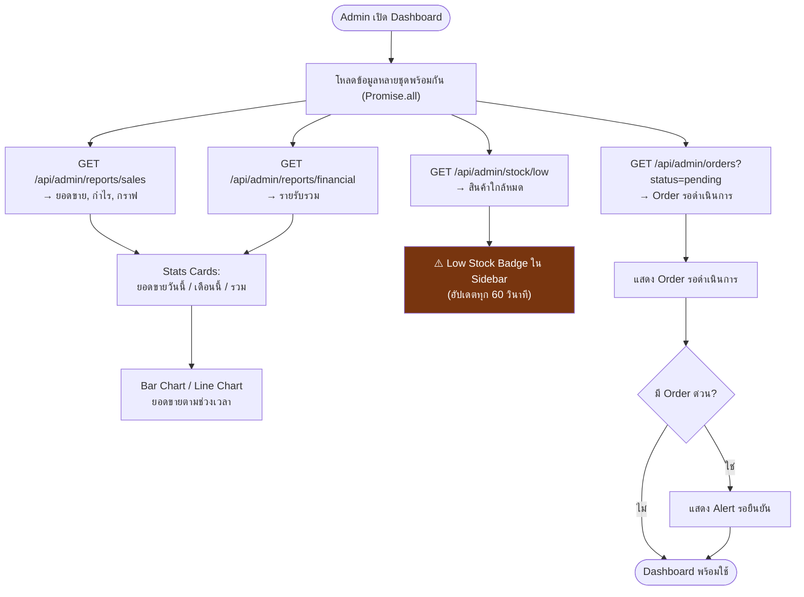
```mermaid
flowchart TD
    A([Admin เปิด Dashboard]) --> B["โหลดข้อมูลหลายชุดพร้อมกัน (Promise.all)"]

    B --> C1["GET /api/admin/reports/sales\n→ ยอดขาย, กำไร, กราฟ"]
    B --> C2["GET /api/admin/reports/financial\n→ รายรับรวม"]
    B --> C3["GET /api/admin/stock/low\n→ สินค้าใกล้หมด"]
    B --> C4["GET /api/admin/orders?status=pending\n→ Order รอดำเนินการ"]

    C1 --> D[Stats Cards:\nยอดขายวันนี้ / เดือนนี้ / รวม]
    C2 --> D
    C3 --> E["⚠️ Low Stock Badge ใน Sidebar\n(อัปเดตทุก 60 วินาที)"]
    C4 --> F[แสดง Order รอดำเนินการ]

    D --> G[Bar Chart / Line Chart\nยอดขายตามช่วงเวลา]
    F --> H{มี Order ด่วน?}
    H -- ใช่ --> I[แสดง Alert รอยืนยัน]
    H -- ไม่ --> J([Dashboard พร้อมใช้])
    I --> J

    style E fill:#78350f,color:#fff
```

---

## A3. จัดการสินค้า (Products)

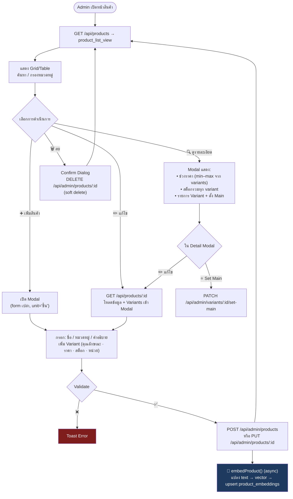
```mermaid
flowchart TD
    A([Admin เปิดหน้าสินค้า]) --> B["GET /api/products → product_list_view"]
    B --> C["แสดง Grid/Table\nค้นหา / กรองหมวดหมู่"]

    C --> ACT{เลือกการดำเนินการ}

    ACT -- "➕ เพิ่มสินค้า" --> M1["เปิด Modal\n(form เปล่า, unit='ชิ้น')"]
    ACT -- "✏️ แก้ไข" --> M2["GET /api/products/:id\nโหลดข้อมูล + Variants เข้า Modal"]
    ACT -- "🔍 ดูรายละเอียด" --> DT["Modal แสดง:\n• ช่วงราคา (min–max จาก variants)\n• สต็อกรวมทุก variant\n• รายการ Variant + ตั้ง Main"]
    ACT -- "🗑️ ลบ" --> DEL["Confirm Dialog\nDELETE /api/admin/products/:id\n(soft delete)"]

    M1 --> F["กรอก: ชื่อ / หมวดหมู่ / คำอธิบาย\nเพิ่ม Variant (คุณลักษณะ · ราคา · สต็อก · หน่วย)"]
    M2 --> F

    F --> V{Validate}
    V -- ❌ --> ERR["Toast Error"]
    V -- ✅ --> SAVE["POST /api/admin/products\nหรือ PUT /api/admin/products/:id"]
    SAVE --> EMB["🔵 embedProduct() (async)\nแปลง text → vector → upsert product_embeddings"]
    SAVE --> B

    DEL --> B
    DT --> ACT2{ใน Detail Modal}
    ACT2 -- "⭐ Set Main" --> SM["PATCH /api/admin/variants/:id/set-main"]
    ACT2 -- "✏️ แก้ไข" --> M2

    style ERR fill:#7f1d1d,color:#fff
    style EMB fill:#1e3a5f,color:#fff
```

---

## A4. จัดการสต็อก (Stock Management)

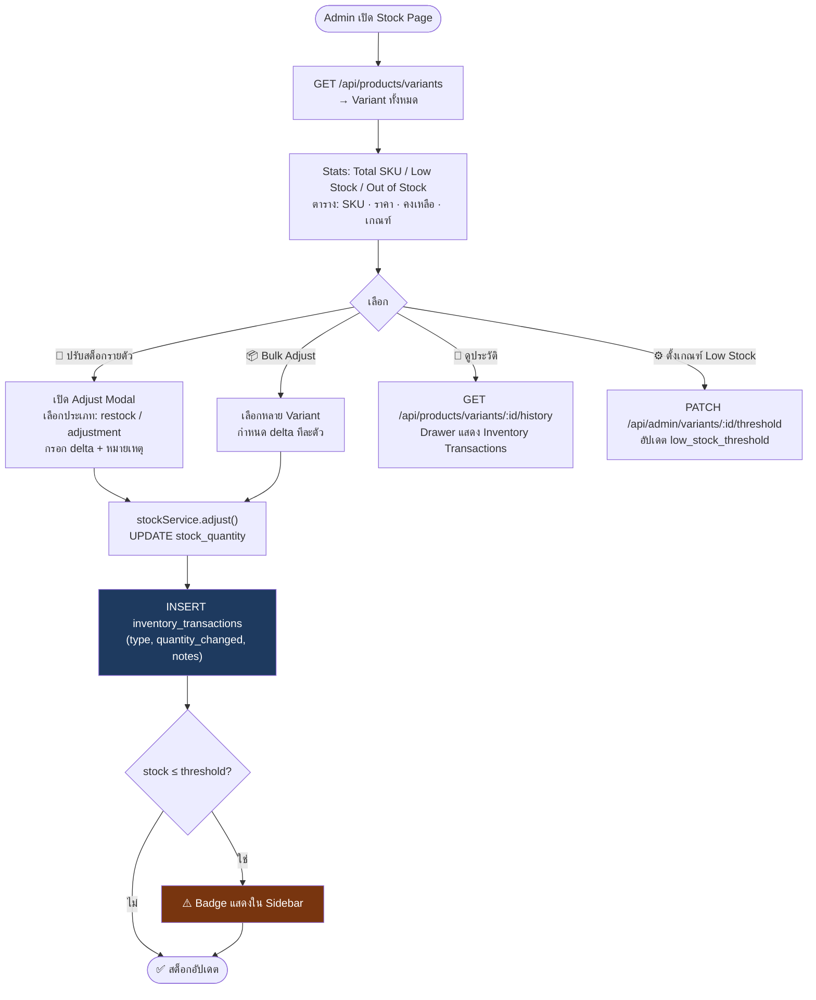
```mermaid
flowchart TD
    A([Admin เปิด Stock Page]) --> B["GET /api/products/variants\n→ Variant ทั้งหมด"]
    B --> C["Stats: Total SKU / Low Stock / Out of Stock\nตาราง: SKU · ราคา · คงเหลือ · เกณฑ์"]

    C --> ACT{เลือก}

    ACT -- "🔧 ปรับสต็อกรายตัว" --> AD1["เปิด Adjust Modal\nเลือกประเภท: restock / adjustment\nกรอก delta + หมายเหตุ"]
    ACT -- "📦 Bulk Adjust" --> AD2["เลือกหลาย Variant\nกำหนด delta ทีละตัว"]
    ACT -- "📜 ดูประวัติ" --> HIS["GET /api/products/variants/:id/history\nDrawer แสดง Inventory Transactions"]
    ACT -- "⚙️ ตั้งเกณฑ์ Low Stock" --> THR["PATCH /api/admin/variants/:id/threshold\nอัปเดต low_stock_threshold"]

    AD1 --> SVC["stockService.adjust()\nUPDATE stock_quantity"]
    AD2 --> SVC
    SVC --> LOG["INSERT inventory_transactions\n(type, quantity_changed, notes)"]
    LOG --> CHK{stock ≤ threshold?}
    CHK -- ใช่ --> WARN["⚠️ Badge แสดงใน Sidebar"]
    CHK -- ไม่ --> OK([✅ สต็อกอัปเดต])
    WARN --> OK

    style WARN fill:#78350f,color:#fff
    style LOG fill:#1e3a5f,color:#fff
```

---

## A5. จัดการคำสั่งซื้อ (Orders)

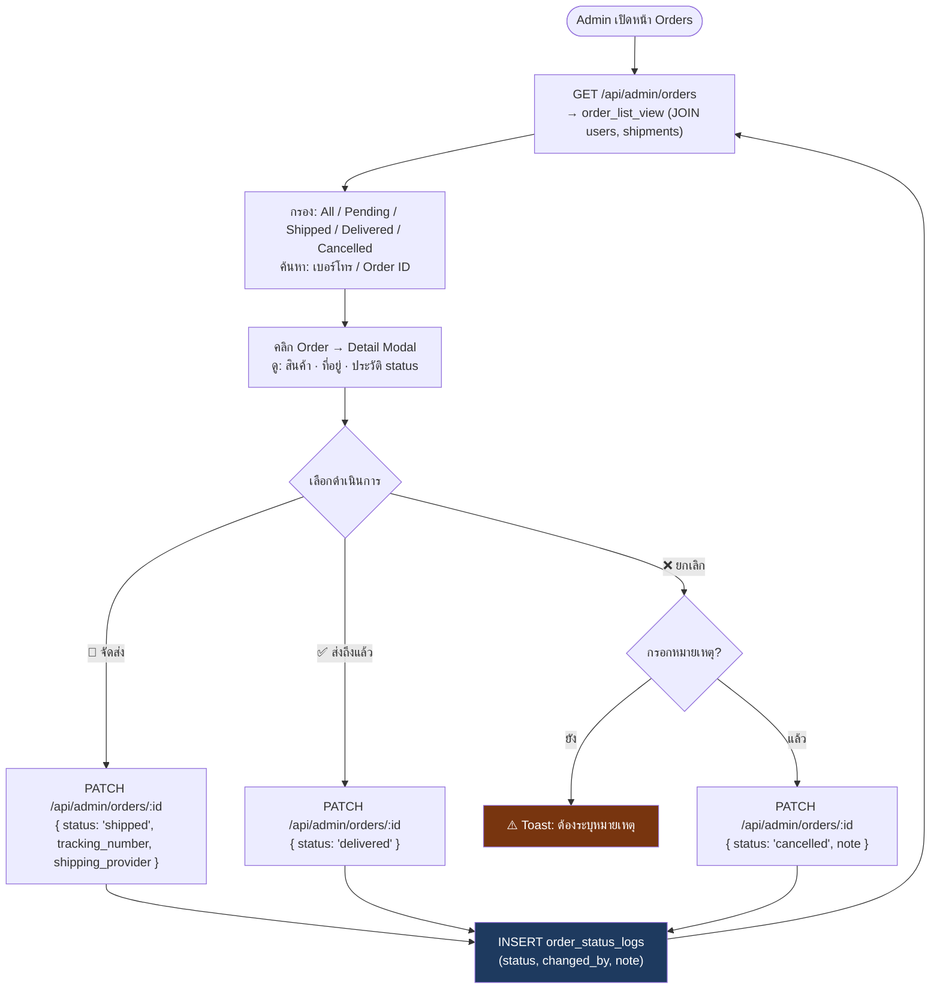
```mermaid
flowchart TD
    A([Admin เปิดหน้า Orders]) --> B["GET /api/admin/orders\n→ order_list_view (JOIN users, shipments)"]
    B --> C["กรอง: All / Pending / Shipped / Delivered / Cancelled\nค้นหา: เบอร์โทร / Order ID"]

    C --> SEL["คลิก Order → Detail Modal\nดู: สินค้า · ที่อยู่ · ประวัติ status"]

    SEL --> ACT{เลือกดำเนินการ}

    ACT -- "🚚 จัดส่ง" --> SHIP["PATCH /api/admin/orders/:id\n{ status: 'shipped', tracking_number, shipping_provider }"]
    ACT -- "✅ ส่งถึงแล้ว" --> DELIV["PATCH /api/admin/orders/:id\n{ status: 'delivered' }"]
    ACT -- "❌ ยกเลิก" --> NOTE{กรอกหมายเหตุ?}
    NOTE -- ยัง --> ERRN["⚠️ Toast: ต้องระบุหมายเหตุ"]
    NOTE -- แล้ว --> CANCEL["PATCH /api/admin/orders/:id\n{ status: 'cancelled', note }"]

    SHIP --> LOG["INSERT order_status_logs\n(status, changed_by, note)"]
    DELIV --> LOG
    CANCEL --> LOG

    LOG --> B

    style ERRN fill:#78350f,color:#fff
    style LOG fill:#1e3a5f,color:#fff
```

---

## A6. รายงาน (Reports)

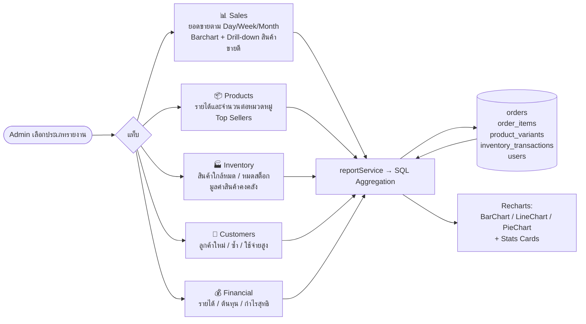
```mermaid
flowchart LR
    A([Admin เลือกประเภทรายงาน]) --> TAB{แท็บ}

    TAB --> S["📊 Sales\nยอดขายตาม Day/Week/Month\nBarchart + Drill-down สินค้าขายดี"]
    TAB --> P["📦 Products\nรายได้และจำนวนต่อหมวดหมู่\nTop Sellers"]
    TAB --> I["🏭 Inventory\nสินค้าใกล้หมด / หมดสต็อก\nมูลค่าสินค้าคงคลัง"]
    TAB --> C["👥 Customers\nลูกค้าใหม่ / ซ้ำ / ใช้จ่ายสูง"]
    TAB --> F["💰 Financial\nรายได้ / ต้นทุน / กำไรสุทธิ"]

    S --> RA[reportService → SQL Aggregation]
    P --> RA
    I --> RA
    C --> RA
    F --> RA

    RA --> DB[("orders\norder_items\nproduct_variants\ninventory_transactions\nusers")]
    DB --> RA
    RA --> CHART["Recharts:\nBarChart / LineChart / PieChart\n+ Stats Cards"]
```

---

## A7. OCR นำเข้าสินค้า

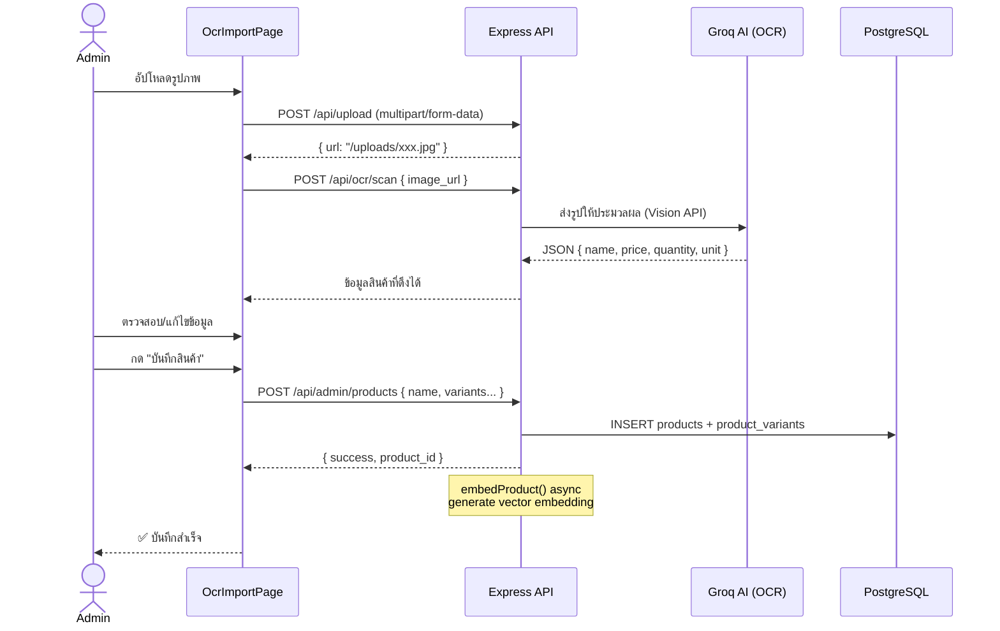
```mermaid
sequenceDiagram
    actor Admin
    participant FE as OcrImportPage
    participant API as Express API
    participant GROQ as Groq AI (OCR)
    participant DB as PostgreSQL

    Admin->>FE: อัปโหลดรูปภาพ
    FE->>API: POST /api/upload (multipart/form-data)
    API-->>FE: { url: "/uploads/xxx.jpg" }

    FE->>API: POST /api/ocr/scan { image_url }
    API->>GROQ: ส่งรูปให้ประมวลผล (Vision API)
    GROQ-->>API: JSON { name, price, quantity, unit }
    API-->>FE: ข้อมูลสินค้าที่ดึงได้

    Admin->>FE: ตรวจสอบ/แก้ไขข้อมูล
    Admin->>FE: กด "บันทึกสินค้า"
    FE->>API: POST /api/admin/products { name, variants... }
    API->>DB: INSERT products + product_variants
    API-->>FE: { success, product_id }
    Note over API: embedProduct() async<br/>generate vector embedding
    FE-->>Admin: ✅ บันทึกสำเร็จ
```

---

## A8. จัดการสมาชิก (Member Management)

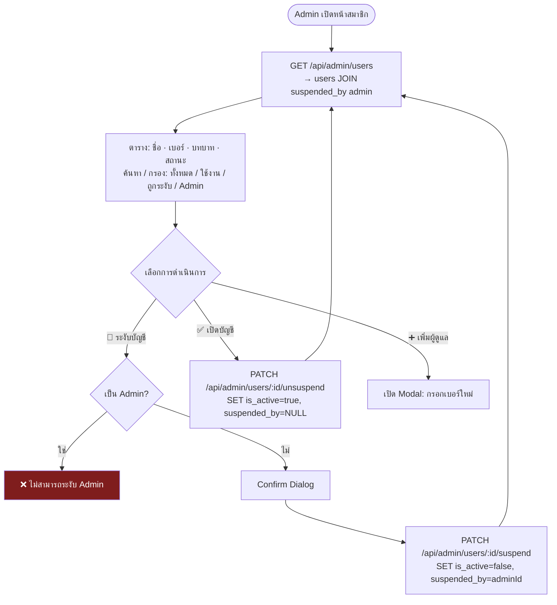
```mermaid
flowchart TD
    A([Admin เปิดหน้าสมาชิก]) --> B["GET /api/admin/users\n→ users JOIN suspended_by admin"]
    B --> C["ตาราง: ชื่อ · เบอร์ · บทบาท · สถานะ\nค้นหา / กรอง: ทั้งหมด / ใช้งาน / ถูกระงับ / Admin"]

    C --> ACT{เลือกการดำเนินการ}

    ACT -- "🚫 ระงับบัญชี" --> SUS_CHK{เป็น Admin?}
    SUS_CHK -- ใช่ --> SUS_ERR["❌ ไม่สามารถระงับ Admin"]
    SUS_CHK -- ไม่ --> SUS_DLG["Confirm Dialog"]
    SUS_DLG --> SUS["PATCH /api/admin/users/:id/suspend\nSET is_active=false, suspended_by=adminId"]

    ACT -- "✅ เปิดบัญชี" --> UNS["PATCH /api/admin/users/:id/unsuspend\nSET is_active=true, suspended_by=NULL"]

    ACT -- "➕ เพิ่มผู้ดูแล" --> OTP["เปิด Modal: กรอกเบอร์ใหม่"]

    SUS --> B
    UNS --> B

    style SUS_ERR fill:#7f1d1d,color:#fff
```

---

## A9. เพิ่มผู้ดูแล (Dual-OTP Add Admin Flow)

```mermaid
sequenceDiagram
    actor Admin as 👤 Admin ปัจจุบัน
    participant FE as MembersPage Modal
    participant API as Express API
    participant DB as PostgreSQL

    Admin->>FE: กรอกเบอร์โทรผู้ดูแลใหม่
    FE->>API: POST /api/admin/users/add-admin/initiate<br/>{ newAdminPhone }
    API->>DB: ตรวจสอบว่าเบอร์ไม่ใช่ Admin อยู่แล้ว
    API->>API: สร้าง OTP 2 ชุด (TTL 5 นาที)
    Note over API: OTP ชุดที่ 1 → Admin ปัจจุบัน<br/>OTP ชุดที่ 2 → Admin ใหม่<br/>(แสดงใน Terminal — Dev mode)
    API-->>FE: { success: true }

    FE->>Admin: Step 2: กรอก OTP ทั้ง 2 ชุด
    Admin->>FE: กรอก otpRequester + otpNewAdmin
    FE->>API: POST /api/admin/users/add-admin/confirm<br/>{ newAdminPhone, requesterOtp, newAdminOtp }

    API->>API: ตรวจสอบ OTP ทั้ง 2 ชุด + TTL
    alt OTP ถูกต้องทั้งคู่
        API->>DB: UPDATE users SET role='admin'<br/>หรือ INSERT users (role='admin')
        API-->>FE: { success: true }
        FE-->>Admin: ✅ เพิ่มผู้ดูแลสำเร็จ
    else OTP ผิดหรือหมดอายุ
        API-->>FE: 400 Error
        FE-->>Admin: ❌ แสดงข้อผิดพลาด
    end
```

---

## A10. ระบบ Embedding / Semantic Search (AI)

```mermaid
flowchart TD
    subgraph AUTO["🔄 Auto-Embed (หลังบันทึกสินค้า)"]
        A1["productService.create() / update()"] --> A2["triggerEmbed(productId)\n(setImmediate — non-blocking)"]
        A2 --> A3["embeddingService.embedProduct(id)"]
    end

    subgraph PIPELINE["🤖 Embedding Pipeline"]
        B1["Query: product JOIN categories JOIN variants"] --> B2["buildText():\n'passage: {name}\\n{desc}\\nหมวด: {cat}\\nรุ่น: {sku} {unit} ฿{price}'"]
        B2 --> B3["Xenova/multilingual-e5-small\n(ONNX Runtime, 384-dim)"]
        B3 --> B4["mean pooling + L2 normalize\n→ float32[384]"]
        B4 --> B5["UPSERT product_embeddings\n(product_id, embedding::vector, text_used)"]
    end

    subgraph ADMIN_API["🛠️ Admin Endpoints"]
        C1["GET /api/admin/embeddings/status\n→ embedded vs total count"]
        C2["POST /api/admin/embeddings/reindex\n→ re-embed ทุกสินค้า (202 Accepted)"]
        C3["POST /api/admin/embeddings/search\n{ query, limit }\n→ cosine similarity ranking"]
    end

    A3 --> B1
    B5 --> D[("product_embeddings\nvector(384)\nHNSW Index")]

    C2 --> A3
    C3 --> E["embedQuery()\n'query: {text}' → vector[384]"]
    E --> F["SELECT ... ORDER BY embedding <=> queryVec\nLIMIT N"]
    F --> D

    style AUTO fill:#1e3a5f,color:#fff
    style PIPELINE fill:#14532d,color:#fff
    style ADMIN_API fill:#4c1d95,color:#fff
```

---

## A11. สถานะผู้ใช้ (User Status State Machine)

```mermaid
stateDiagram-v2
    [*] --> Active : สมัคร OTP สำเร็จ
    Active --> Suspended : Admin ระงับบัญชี\n(suspended_by = adminId)
    Suspended --> Active : Admin เปิดใช้งาน\n(suspended_by = NULL)
    Suspended --> SuspendedPage : Login ขณะถูกระงับ\nredirect /suspended
    SuspendedPage --> [*] : Logout
    Active --> Admin : confirmAddAdmin()\n(dual OTP สำเร็จ)
```
